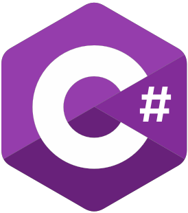
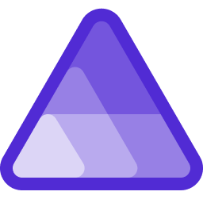

# Djoufson's World 🌍

I am a **Software Engineer** who ❤️ open source.

For some reasons, I am currenntly learning **Golang** 🤯🙆🏾‍♂️

## Some stats

<!--   -->

## Do you want to support me?
To encourage me and and value my work, you can

    

 
 

## Languages and Tools

    
    
    
    
    
    
    
    
    
    
    

